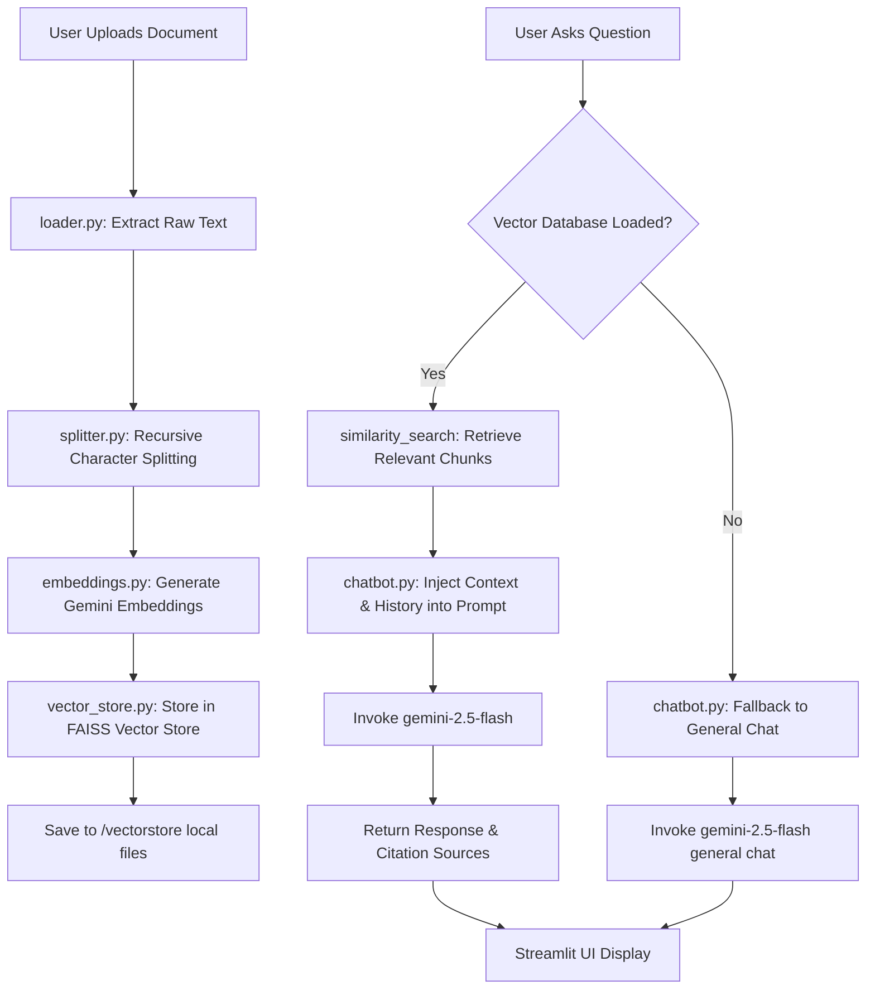

# Antigravity RAG-Based AI Chatbot using Gemini API & Streamlit

Welcome to the **Antigravity RAG-Based AI Chatbot**, a production-ready Retrieval-Augmented Generation application built from scratch. This chatbot allows users to upload PDF, TXT, and DOCX documents, processes them using semantic embeddings (Gemini Embeddings), saves them in a local vector database (FAISS), and answers queries with strict context references. When no files are uploaded, it gracefully falls back to a general conversational AI.

---

## Table of Contents
1. [Project Folder Structure](#project-folder-structure)
2. [Flow Diagram](#flow-diagram)
3. [Key Features](#key-features)
4. [Step-by-Step Installation Guide](#step-by-step-installation-guide)
5. [Advanced Features Code & Explanations](#advanced-features)
6. [Testing Guide](#testing-guide)
7. [Deployment Guide](#deployment-guide)

---

## Project Folder Structure

```text
rag-chatbot/
│
├── app.py                  # Main Streamlit Frontend Application
├── requirements.txt        # Python Dependencies with exact versions
├── .env                    # Environment variables (API Keys)
├── README.md               # Complete project documentation & guide
├── Dockerfile              # Containerization recipe
├── docker-compose.yml      # Orchestration config for local run
│
├── data/                   # Saved copy of raw uploaded documents
│
├── vectorstore/            # Persisted local FAISS index files (.faiss, .pkl)
│
├── src/                    # Backend source code
│   ├── loader.py           # Document parsers (PDF, TXT, DOCX)
│   ├── splitter.py         # Text chunking logic
│   ├── embeddings.py       # Gemini Embeddings API integration
│   ├── vector_store.py     # FAISS database creation, reload, search
│   ├── chatbot.py          # Prompt templates & LLM generation
│   └── utils.py            # API validation, file management, helper tools
│
└── assets/                 # UI screenshots and visual icons
```

---

## Flow Diagram

The diagram below illustrates the detailed request/processing pipeline of the application:



### Process Explanation:
1. **Document Loading**: Raw files uploaded via the Streamlit interface are read as byte-streams or local files.
2. **Text Chunking**: Content is split into chunks of `1000` characters with `200` characters overlap using a recursive strategy to keep paragraphs intact.
3. **Embedding Generation**: The chunks are sent to the Gemini API (`gemini-embedding-001`) to generate dense vectors.
4. **FAISS Storage**: Vectors are indexed in FAISS for fast similarity queries and written to disk inside the `/vectorstore/` folder.
5. **Similarity Search**: When a user queries, FAISS performs L2 distance search to fetch the top `4` matches.
6. **Context Generation**: Chunks and conversation history are formatted into a prompt which instructs Gemini (`gemini-2.5-flash`) to answer only using context.

---

## Key Features

- **Multi-Format Loader**: Supports PDF (`pypdf`), DOCX (`docx2txt`), and plain TXT files.
- **Sleek Custom UI**: Tailored using deep dark-mode aesthetic CSS, styled chat bubbles, custom gradient buttons, and responsive citation badges.
- **Session Continuity**: Retains conversation history and reloads the FAISS index automatically on startup.
- **Strict Citation**: Extracts and visually tags the document name and page number for every reference.

---

## Step-by-Step Installation Guide

This guide is designed for absolute beginners to set up the project on local systems.

### 1. Install System Tools
- **Python**: Download and install [Python 3.9+](https://www.python.org/downloads/). Ensure you check "Add Python to PATH" during installation.
- **VS Code**: Download and install [Visual Studio Code](https://code.visualstudio.com/).

### 2. Create Project Directory
Create a folder named `rag-chatbot` on your system. Open this directory inside VS Code.

### 3. Open Terminal in VS Code
Press ``Ctrl + ` `` (Windows/Linux) or ``Cmd + ` `` (macOS) to open the built-in terminal.

### 4. Create and Activate Virtual Environment

**On Windows (PowerShell):**
```powershell
python -m venv venv
.\venv\Scripts\Activate.ps1
```

**On macOS/Linux:**
```bash
python3 -m venv venv
source venv/bin/activate
```

### 5. Install Dependencies
Run the command below to install all pinned libraries:
```bash
pip install -r requirements.txt
```

### 6. Set Up Gemini API Key
1. Visit [Google AI Studio](https://aistudio.google.com/) and click **Get API Key**.
2. Rename the template `.env` file to `.env` or create a new one:
```env
GOOGLE_API_KEY=AIzaSyYourGeminiApiKeyHere...
```

### 7. Run the Application
Start the Streamlit development server:
```bash
streamlit run app.py
```
The browser will automatically open to `http://localhost:8501`.

---

## Advanced Features

Here is the source code implementation and explanation for advanced additions to the chatbot:

### 1. Hybrid Search (Keyword + Dense Vector)
Combine semantic retrieval (FAISS) with keyword matching (BM25) using LangChain's Ensemble Retriever:
```python
# Code snippet for src/vector_store.py
from langchain.retrievers import EnsembleRetriever
from langchain_community.retrievers import BM25Retriever

def get_hybrid_retriever(vectorstore, chunks, k=4):
    bm25_retriever = BM25Retriever.from_documents(chunks)
    bm25_retriever.k = k
    
    faiss_retriever = vectorstore.as_retriever(search_kwargs={"k": k})
    
    # Weight FAISS semantic search as 70% and BM25 text match as 30%
    ensemble_retriever = EnsembleRetriever(
        retrievers=[bm25_retriever, faiss_retriever],
        weights=[0.3, 0.7]
    )
    return ensemble_retriever
```

### 2. Re-Ranking (Cohere / Sentence Transformers)
Re-ranking results using Cross-Encoders improves document relevance before feeding context to Gemini:
```python
# Install sentence-transformers
# pip install sentence-transformers
from sentence_transformers import CrossEncoder

def rerank_documents(query: str, documents: list, top_n: int = 2) -> list:
    model = CrossEncoder('cross-encoder/ms-marco-MiniLM-L-6-v2')
    pairs = [[query, doc.page_content] for doc in documents]
    scores = model.predict(pairs)
    
    # Sort docs based on score desc
    sorted_docs = [doc for _, doc in sorted(zip(scores, documents), key=lambda x: x[0], reverse=True)]
    return sorted_docs[:top_n]
```

### 3. Docker Container Deployment
Use the included `Dockerfile` and `docker-compose.yml` to run the app globally:
```bash
# Build the container
docker-compose build

# Launch the app
docker-compose up -d
```

### 4. Exporting Chats to PDF
You can export conversation transcripts using the `reportlab` library:
```python
# pip install reportlab
from reportlab.lib.pagesizes import letter
from reportlab.pdfgen import canvas

def export_chat_history_to_pdf(chat_history: list, filepath: str):
    c = canvas.Canvas(filepath, pagesize=letter)
    width, height = letter
    y = height - 50
    
    c.setFont("Helvetica-Bold", 16)
    c.drawString(50, y, "Conversation Transcript - RAG Chatbot")
    y -= 40
    
    c.setFont("Helvetica", 10)
    for msg in chat_history:
        role = msg['role'].upper()
        content = msg['content'][:80] + "..." if len(msg['content']) > 80 else msg['content']
        c.drawString(50, y, f"{role}: {content}")
        y -= 25
        if y < 50:
            c.showPage()
            y = height - 50
    c.save()
```

---

## Testing Guide

Perform these manual test cases to verify application reliability:

| Test ID | Scenario | Input / Action | Expected Result |
|---|---|---|---|
| **TC-01** | Upload PDF | Upload a standard multi-page PDF and click "Process". | Status changes to "Verified", pages are extracted, vector store is saved locally, files display in sidebar. |
| **TC-02** | Query Context | Ask a direct question answered inside the PDF. | Chatbot answers correctly using specific keywords from document and displays the source with page number. |
| **TC-03** | Query Out of Scope | Ask a question completely unrelated to the uploaded files (e.g. "What is the capital of France?"). | Chatbot politely states it cannot find the answer in the provided documents (rather than hallucinating details). |
| **TC-04** | Empty Document | Upload a 0-byte or empty txt document. | System alerts the user with an error dialog stating "Failed to process empty document". |
| **TC-05** | Fallback Chat | Delete database index, ask "Explain quantum computing". | Chatbot triggers general conversation path and answers correctly using Gemini. |

---

## Deployment Guide

### 1. Streamlit Community Cloud (Recommended)
1. Commit the project to GitHub (exclude `.env` and `venv` using `.gitignore`).
2. Log into [Streamlit Share](https://share.streamlit.io/).
3. Connect your repository, specify `app.py` as the entrypoint.
4. Add your Gemini Key in **Advanced Settings** -> **Secrets**:
```toml
GOOGLE_API_KEY = "your-api-key"
```
5. Click **Deploy**.

### 2. Render
1. Create a `render.yaml` blueprint:
```yaml
services:
  - type: web
    name: gemini-rag-chatbot
    env: python
    buildCommand: pip install -r requirements.txt
    startCommand: streamlit run app.py --server.port $PORT --server.address 0.0.0.0
    envVars:
      - key: GOOGLE_API_KEY
        sync: false
```
2. Link your GitHub repository to Render and deploy.

### 3. AWS EC2
1. Launch an EC2 instance (Ubuntu 22.04 LTS). Expose port `8501` in the security group.
2. SSH into the instance:
```bash
sudo apt update && sudo apt install -y python3-pip python3-venv git
git clone <your-repo-link>
cd rag-chatbot
python3 -m venv venv
source venv/bin/activate
pip install -r requirements.txt
streamlit run app.py --server.port=8501 --server.address=0.0.0.0
```
